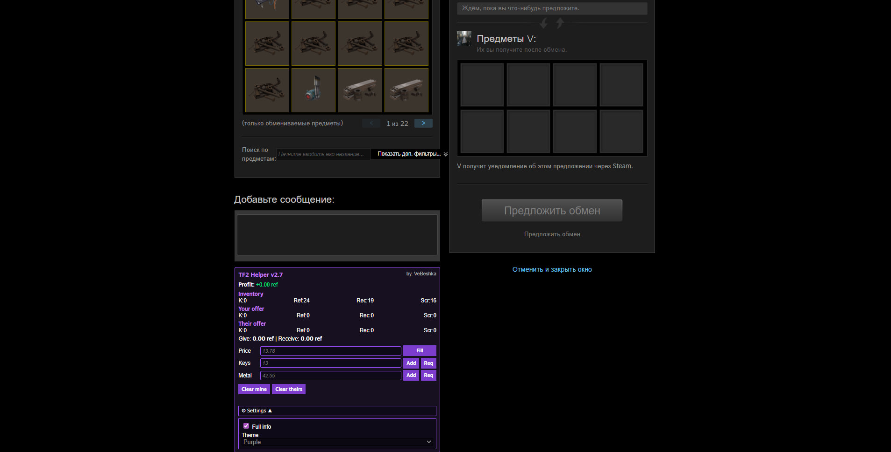

# TF2 Trade Helper INLINE


Inline helper for TF2 trading on Backpack.tf and Steam trade offers.

---

# English

## Features

* Backpack.tf inline price overlay
* Profit calculation in refined
* Key → refined conversion
* Supports:

  * Unique
  * Strange
  * Vintage
  * Festivized
  * Painted items
* Ignores fake painted/spell/lvl listings
* Steam trade offer helper
* Faster Backpack.tf listing parsing
* Compact inline UI

## Supported Sites

* Backpack.tf
* Steam Trade Offers

## Installation

### 1. Install Tampermonkey

Install the browser extension first:

* [Tampermonkey Chrome](https://chromewebstore.google.com/detail/tampermonkey/dhdgffkkebhmkfjojejmpbldmpobfkfo?utm_source=chatgpt.com)
* [Tampermonkey Firefox](https://addons.mozilla.org/firefox/addon/tampermonkey/?utm_source=chatgpt.com)

### 2. Install Script

Open this link:

```text
https://raw.githubusercontent.com/VeBeshka/tf2-trade-helper-inline/main/tf2-trade-helper.user.js
```

Tampermonkey will automatically offer installation.

---

# Русский

## Возможности

* Встроенное отображение цен Backpack.tf
* Подсчёт прибыли в refined
* Конвертация key → refined
* Поддержка:

  * Unique
  * Strange
  * Vintage
  * Festivized
  * Покрашенных предметов
* Игнорирование фейковых spell/paint/lvl листингов
* Помощь в Steam трейдах
* Быстрый анализ Backpack.tf
* Компактный интерфейс прямо на сайте

## Поддерживаемые сайты

* Backpack.tf
* Steam Trade Offers

## Установка

### 1. Установите Tampermonkey

Сначала установите расширение:

* [Tampermonkey Chrome](https://chromewebstore.google.com/detail/tampermonkey/dhdgffkkebhmkfjojejmpbldmpobfkfo?utm_source=chatgpt.com)
* [Tampermonkey Firefox](https://addons.mozilla.org/firefox/addon/tampermonkey/?utm_source=chatgpt.com)

### 2. Установите скрипт

Откройте ссылку:

```text
https://raw.githubusercontent.com/VeBeshka/tf2-trade-helper-inline/main/tf2-trade-helper.user.js
```

Tampermonkey автоматически предложит установить скрипт.

## Автор

VeBeshka

# tf2-trade-helper-inline
